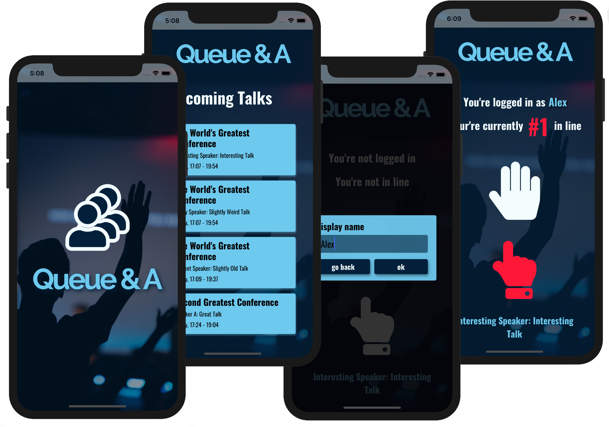

# Queue&A

Digital queuing app (iOS and Android) for Q&As.

Always be the first in line.

## Screenshots

## Getting started

1. Clone repo: <code>git clone https://github.com/atsteinberg/QueueAndA.git</code>
2. Install dependencies: <code>npm i</code> (if you haven't installed node and npm, the node package manager, do that first: [install npm](https://www.npmjs.com/get-npm))
3. run server: <code>node server/index.js</code>
4. run app: <code>cd newClient && npm start</code>

## Tech Stack

- [React native with Expo](https://expo.io/)

- [Typescript](https://www.typescriptlang.org/)

- [Socket.io](https://socket.io/)

- [Koa](https://koajs.com/)

## Developer

Alex Steinberg: [github](https://github.com/atsteinberg) – [linkedin]()
