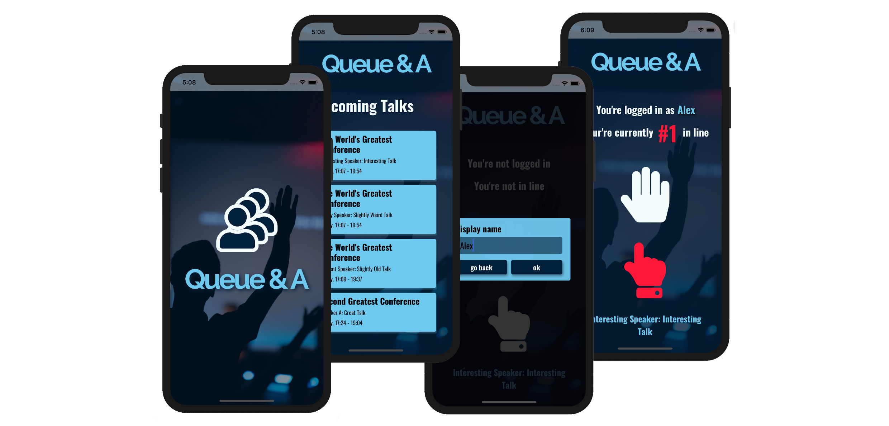

# Queue&A

Always be the first in line.

Digital queuing app (iOS and Android) for Q&As.

Automatically manage Q&A sessions with hand (new question) and finger (follow up question) priority support.

## Screenshots

## Getting started

1. Clone repo: <code>git clone https://github.com/atsteinberg/QueueAndA.git</code>
2. Install dependencies: <code>npm i</code> (if you haven't installed node and npm, the node package manager, do that first: [install npm](https://www.npmjs.com/get-npm))
3. run server: <code>node server/index.js</code>
4. run app: <code>cd newClient && npm start</code>

## Built with

- [React native with Expo](https://reactnative.dev/)

- [Typescript](https://www.typescriptlang.org/)

- [Socket.io](https://socket.io/)

- [Koa](https://koajs.com/)

- [Blood, Sweat & Tears](https://bloodsweatandtears.com/)

## Developer

- Alex Steinberg: [github](https://github.com/atsteinberg) – [linkedin](www.linkedin.com/in/atsteinberg) – [web](https://atsteinberg.github.io)
